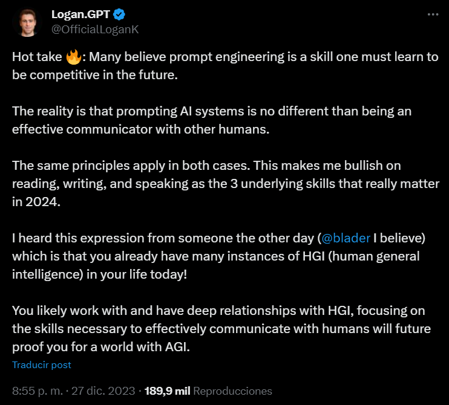

> El gerente de OpenAI dice que las conversaciones con  IA no son diferentes a las conversaciones con humanos y enumera las habilidades que serán importantes en 2024

## Nueva Ingeniería de Prompt: Un Emocionante Campo Profesional Emergente Este Año"
Las empresas buscan personas capacitadas para instruir a los chatbots de IA.
Un empleado de OpenAI afirma que la ingeniería de instrucciones es similar a hablar con humanos.

ChatGPT irrumpió en el mundo de la tecnología en noviembre de 2022 y, desde entonces, mucha gente está interesada en aprender a hablar con los chatbots de IA. Este año, muchas empresas han contratado a "ingenieros de instrucciones", un nuevo campo profesional que requiere que los candidatos conozcan bien la IA e inventen nuevas formas de dar instrucciones a los chatbots de IA para obtener los mejores resultados.

Se dice que la ingeniería rápida es una habilidad muy necesaria en la era de la IA. Varios sitios web de educación, como Coursera, incluso pusieron en marcha cursos relacionados con la ingeniería pronta y vieron un gran número de solicitantes. Sin embargo, un empleado de OpenAI afirma que la ingeniería rápida es bastante similar a hablar con seres humanos y que habilidades como leer, escribir y hablar seguirán siendo muy necesarias en 2024.

## Los empleados de OpenAI hablan sobre  ingeniería rápida
publicó un empleado de OpenAI en Twitter (X).
Pero añade que trabajar con un sistema de IA no es fundamentalmente diferente de comunicarse exitosamente con otro ser humano.
Además, sostiene que  las habilidades que "realmente importan" en 2024 son leer, escribir y hablar, ya que los principios de la comunicación efectiva se aplican por igual a ambos escenarios.

El gerente de OpenAI concluyó la publicación diciendo que la clave para navegar por el mundo usando AGI es mejorar estas habilidades de comunicación.
La idea es que ya existen muchos ejemplos de inteligencia general humana (HGI) en nuestras vidas hoy en día, y al centrarnos en las habilidades necesarias para comunicarnos eficazmente con las personas, podemos significa ser capaces de prepararnos para los tiempos.

"Muchos creen que la ingeniería de avisos es una habilidad que hay que aprender para ser competitivo en el futuro. La realidad es que dirigir sistemas de IA no es diferente de ser un comunicador eficaz con otros seres humanos. En ambos casos se aplican los mismos principios. Esto me hace apostar por la lectura, la escritura y la expresión oral como las tres habilidades subyacentes que realmente importarán en 2024. El otro día escuché a alguien (creo que a @blader) decir que ya tienes muchos ejemplos de HGI (inteligencia general humana) en tu vida actual. Es probable que trabajes y tengas profundas relaciones con HGI, centrarte en las habilidades necesarias para comunicarte eficazmente con los humanos te pondrá a prueba en el futuro para un mundo con AGI."

## Se demanda un puesto de ingeniero rápido
En marzo, una startup de inteligencia artificial con sede en San Francisco llamada Anthropic se volvió viral por  contratar ingenieros y bibliotecarios listos para trabajar por hasta 335.
000 dólares al año. Cuando se convierte a INR, son aproximadamente 2,7 millones de rupias.

Un anuncio de trabajo en el sitio web de la empresa dice: "Dado que el campo de la ingeniería rápida tiene probablemente menos de dos años, este puesto es un poco difícil de contratar. Si tienes proyectos en marcha que demuestren la ingeniería rápida en LLM o modelos de generación de imágenes, nos encantaría verlos. Si aún no has hecho mucho en el campo de la ingeniería de instrucciones, la mejor manera de demostrar tus habilidades de ingeniería de instrucciones es pasar algún tiempo experimentando con Claude o GPT3 y mostrar que has logrado obtener comportamientos complejos a partir de una serie de instrucciones bien elaboradas."
