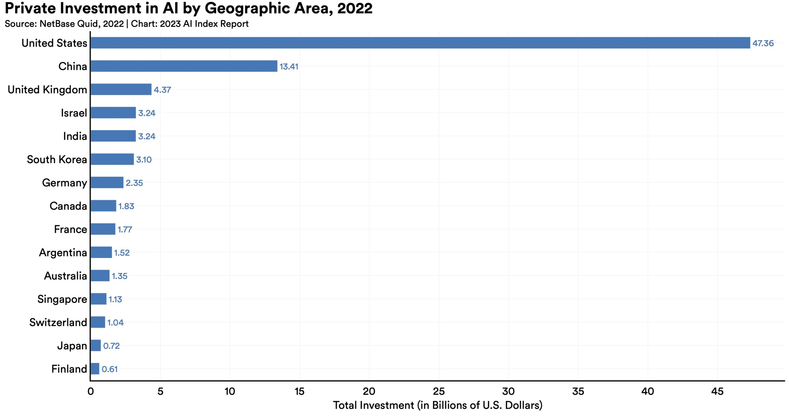

> Los progresos en inteligencia artificial presentan posibilidades sin precedentes, pero también pueden ocasionar alteraciones en ámbitos económicos, políticos y sociales. 

## Introducción
Aunque la inteligencia artificial (IA) ha estado presente durante décadas, recientes avances la han catapultado a la vanguardia. Según los expertos, este ascenso puede equipararse a revoluciones tecnológicas previas, aportando billones de dólares en productividad a la economía global, pero también introduciendo nuevos riesgos capaces de alterar el orden geopolítico mundial y la estructura misma de la sociedad.

La gestión de estos riesgos se vuelve crucial, desatando un debate a nivel mundial sobre la gobernanza de la IA. Grandes potencias como **Estados Unidos, China y la Unión Europea (UE)** están adoptando enfoques cada vez más diversos para regular esta tecnología. Mientras tanto, el desarrollo y la implementación de la IA continúan avanzando a un ritmo exponencial.

## ¿Cómo se define la inteligencia artificial?
Aunque no existe una definición única, el término "inteligencia artificial" generalmente se refiere a la capacidad de las computadoras para llevar a cabo tareas que tradicionalmente se asocian con las habilidades humanas. La génesis de este concepto se remonta a la década de 1950, cuando John McCarthy, un científico informático de la Universidad de Stanford, lo empleó para describir "la ciencia y la ingeniería de fabricar máquinas inteligentes". Para McCarthy, la inteligencia se medía por la capacidad de resolver problemas en entornos dinámicos.

Desde 2022, la disponibilidad pública de herramientas de inteligencia artificial generativa, como el chatbot **ChatGPT**, ha catapultado la tecnología a la atención pública. Estos modelos se basan en grandes conjuntos de datos de entrenamiento para generar resultados estadísticamente probables en respuesta a indicaciones específicas. Las herramientas impulsadas por estos modelos pueden generar texto, imágenes, audio y otros contenidos que se asemejan a los producidos por humanos.

Otro concepto frecuentemente mencionado es la inteligencia artificial general (AGI) o IA "fuerte", que se refiere a sistemas capaces de aprender y aplicar conocimientos de manera similar a los humanos. Sin embargo, tales sistemas aún no existen, y los expertos discrepan en cuanto a sus implicaciones.

## ¿Cómo evolucionó la IA?
Los estudios sobre inteligencia artificial tienen una historia de ochenta años, y se reconoce que figuras como los matemáticos **Alan Turing y John von Neumann** son padres fundadores de esta disciplina. Desde las primeras lecciones de código binario a las computadoras rudimentarias, las empresas de software han aprovechado la IA para impulsar herramientas como programas de ajedrez y traductores en línea.

En naciones que lideran las inversiones en IA, el desarrollo ha estado históricamente vinculado a la financiación pública. En China, la investigación en IA se financia principalmente a través del gobierno, mientras que en Estados Unidos, durante décadas, las investigaciones fueron respaldadas por agencias federales como la Agencia de Proyectos de Investigación Avanzada de Defensa (DARPA). En los últimos años, el impulso del desarrollo de la IA en Estados Unidos ha pasado en gran medida al sector privado, que ha invertido cuantiosas sumas de dinero en esta iniciativa.

<small>Source: NetBase Quid via [Stanford University](https://aiindex.stanford.edu/report/) Artificial Intelligence Index Report.</small>

En 2022, el presidente Joe Biden de los Estados Unidos promulgó la Ley CHIPS y Ciencia, la cual redirige los fondos del gobierno estadounidense hacia la investigación y desarrollo tecnológico. Esta legislación asigna 280 mil millones de dólares en gasto federal para semiconductores, el hardware avanzado necesario para respaldar las enormes capacidades de procesamiento y almacenamiento de datos requeridas por la inteligencia artificial. En enero de 2023, ChatGPT se destacó como la aplicación de consumo de más rápido crecimiento en la historia.

El advenimiento de la inteligencia artificial representa un momento equiparable al **Big Bang**, marcando el inicio de una revolución tecnológica que transformará el mundo y reformulará la política, las economías y las sociedades, según señalan Ian Bremmer, presidente de Eurasia Group, y Mustafa Suleyman, director ejecutivo de Inflection AI, en su artículo para Foreign Affairs.

## ¿Cuáles podrían ser los impactos de la inteligencia artificial en la economía global?
Empresas y organizaciones en todo el mundo ya están integrando herramientas de inteligencia artificial en sus operaciones. Fabricantes de automóviles autónomos como Tesla han empleado la IA durante años, al igual que bancos de inversión que confían en modelos algorítmicos para ciertas operaciones y empresas tecnológicas que utilizan algoritmos para publicidad dirigida. Sin embargo, con la llegada de ChatGPT, incluso empresas menos centradas en la tecnología han comenzado a adoptar herramientas de inteligencia artificial generativa para automatizar sistemas como el servicio al cliente. Según una encuesta de la consultora McKinsey realizada en abril de 2023, un tercio de las empresas en todo el mundo afirmaron estar utilizando IA de alguna manera.

La adopción generalizada de la IA tiene el potencial de acelerar la innovación tecnológica en todos los sectores. La industria de semiconductores ya ha experimentado un auge; Nvidia, la empresa estadounidense que fabrica la mayoría de los chips de IA, vio un aumento de más del triple en sus acciones en 2023, alcanzando una valoración total de más de 1 billón de dólares debido a la creciente demanda mundial de semiconductores.

Numerosos expertos anticipan un considerable impulso para la economía global a medida que la industria de la IA crece, proyectando un aumento de 7 billones de dólares adicionales en el producto interno bruto (PIB) mundial anual durante la próxima década. Sebastian Mallaby, experto del CFR, expresó en un episodio del podcast Why It Matters: "Las economías que rechacen la adopción de la IA se quedarán rezagadas. Casi cualquier desafío cognitivo imaginable, desde estrategias para abordar el cambio climático hasta desafíos médicos o hacer que la fusión nuclear funcione, será más abordable gracias a la inteligencia artificial".

## ¿La inteligencia artificial resultará en la pérdida de empleo?
Al igual que con otros cambios tecnológicos a gran escala en la historia, la inteligencia artificial (IA) podría generar un equilibrio entre mayor productividad y la disminución de empleos. Sin embargo, a diferencia de avances anteriores que principalmente eliminaron empleos menos calificados, la IA generativa podría amenazar roles administrativos y posiblemente sustituir empleos en diversas industrias de manera más rápida que nunca. Según la Organización para la Cooperación y el Desarrollo Económicos (OCDE), aproximadamente una cuarta parte de los empleos en todo el mundo enfrenta un alto riesgo de ser reemplazados por la automatización de la IA. Estos trabajos suelen depender de tareas que la IA generativa podría realizar con un nivel de calidad comparable al de un trabajador humano, como la recopilación de información y el análisis de datos, según un estudio del Pew Research Center. Los trabajadores con una "alta exposición" al reemplazo por IA incluyen contadores, desarrolladores web, profesionales de marketing y redactores técnicos.

El auge de la inteligencia artificial (IA) generativa ha suscitado preocupaciones sobre la desigualdad, ya que los empleos más calificados parecen ser más resistentes a las interrupciones tecnológicas, según la Organización para la Cooperación y el Desarrollo Económicos (OCDE). Sin embargo, otro análisis plantea la posibilidad de que los trabajadores menos calificados se beneficien al utilizar herramientas de inteligencia artificial para aumentar la productividad. Un estudio realizado en 2023 por investigadores del Instituto Tecnológico de Massachusetts (MIT) y la Universidad de Stanford reveló que los operadores de centros de llamadas menos experimentados duplicaron las ganancias de productividad en comparación con sus colegas más experimentados después de implementar el uso de IA.

##  ¿Qué sigue para la IA?
En el ámbito de la gobernanza de la inteligencia artificial (IA), la relación entre Estados Unidos y China desempeña un papel crucial. Mientras Beijing busca convertirse en el líder mundial en "teorías, tecnologías y aplicaciones de IA" para 2030, los políticos en Washington buscan establecer barreras al desarrollo de la IA sin socavar la ventaja tecnológica de Estados Unidos.

Simultáneamente, la tecnología de inteligencia artificial avanza rápidamente. La potencia informática se duplica cada 3,4 meses desde 2012, y se espera que los modelos contengan cien veces más capacidad de cómputo para 2025, según los científicos de IA.

Ante la ausencia de una gobernanza global sólida, las empresas que lideran el desarrollo de la IA están ejerciendo un poder que tradicionalmente corresponde a los Estados-nación. Esto marca el inicio de un orden mundial tecnopolar, según Bremmer y Suleyman, quienes sostienen que estas empresas se han convertido en "actores geopolíticos" y deben participar en la creación de reglas globales.

Dada la enorme capacidad transformadora de la IA, hay mucho en juego. Mallaby sostiene que existe la oportunidad de abordar grandes problemas, desde descubrimientos científicos que curan enfermedades mortales hasta la prevención de los peores efectos del cambio climático y el inicio de una era de prosperidad económica global. Aunque reconoce los riesgos significativos, Mallaby tiene la esperanza de que individuos inteligentes y bien intencionados puedan contribuir a gestionarlos con las salvaguardias adecuadas.