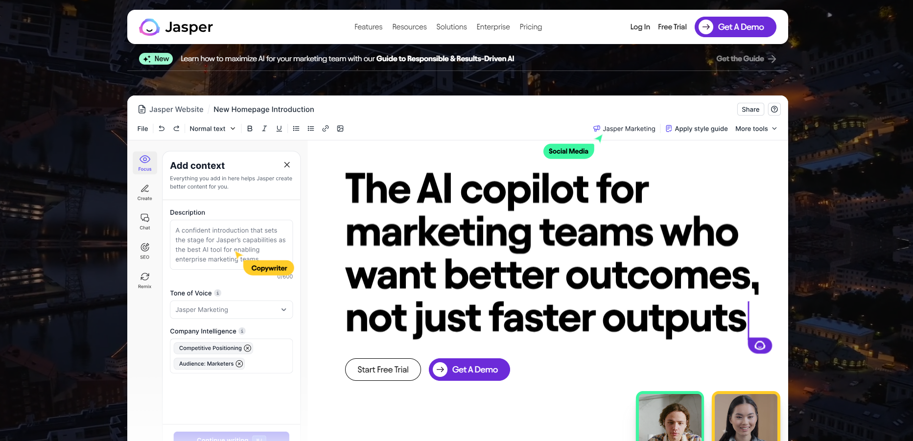
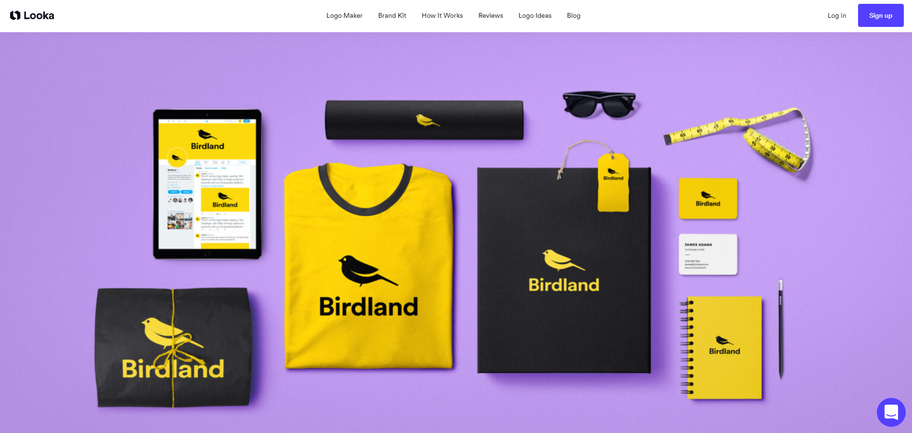

>Descubre las claves para ganar dinero aprovechando al máximo la Inteligencia Artificial. Exploraremos diversas estrategias que te permitirán capitalizar esta innovadora tecnología y maximizar tus oportunidades de ingresos. Desde la creación de contenido impulsada por IA hasta la edición de video, explora cómo la inteligencia artificial puede impulsar tu éxito financiero. ¡Aprende, implementa y comienza a ver los beneficios económicos de la IA hoy mismo!

Con el impresionante avance tecnológico de las herramientas de inteligencia artificial, queda claro que la IA ha llegado para quedarse. Una de las formas innovadoras de generar ingresos es a través de la creación de contenido, y mientras hay diversas opciones, me centraré en un nicho específico: las redes sociales. En este próspero mercado, puedes obtener ingresos a través de la monetización de tus propias redes, programas de afiliados, venta de infoproductos y colaboraciones con marcas. Sin embargo, el desafío común al crear contenido es enfrentarse a la cámara, una barrera que muchos experimentamos. Pero ahora, gracias a la increíble herramienta que te presentaré, esto ya no es un obstáculo. [Visita heygen](https://www.heygen.com/), una plataforma sorprendente que te permite crear vídeos de manera inteligente. Lo fascinante de esta herramienta es su capacidad para replicar tu imagen y voz, eliminando la necesidad de aparecer físicamente en tus propios vídeos. Además, destaca por permitir la conversión de tu voz a múltiples idiomas, una función que, sin duda, te dejará impresionado. ¡Descubre nuevas posibilidades con HeyGen!

## Redacción de Contenido Para Ganar Dinero con la Inteligencia Artificial

La segunda vía para obtener ingresos mediante inteligencia artificial se centra en la redacción, y el primer paso es especializarnos en un nicho específico. Al explorar plataformas como [Fiverr](https://es.fiverr.com/), descubrimos una sección dedicada a habilidades de escritura y traducción, que abarca una amplia gama de servicios con tarifas que van desde 5 € hasta varios cientos de euros. 

Es en este punto donde entra en juego [Jasper](https://www.jasper.ai/), una herramienta revolucionaria que nos capacita para generar información detallada sobre cualquier tema. Jasper transforma cualquier idea en texto, facilitando el proceso de creación de contenido descriptivo. Basta con introducir la idea en la herramienta, y automáticamente se generará un texto relevante sobre la temática en cuestión. Descubre cómo Jasper puede potenciar tu habilidad de redacción y abrir nuevas oportunidades en el mundo de la inteligencia artificial.

## Transformando la Edición de Vídeo con Efectividad y Creatividad

En el ámbito de la edición de vídeo, destaca la facilidad de uso que caracteriza a las nuevas generaciones. En la actualidad, los niños ya no aspiran mayormente a ser médicos, futbolistas o profesores; su sueño se inclina hacia convertirse en youtubers o influencers, revelando una demanda creciente en este campo. Desde mi perspectiva, en lugar de seguir la corriente, es esencial ofrecer soluciones a esta demanda emergente, y aquí es donde entra en juego la edición de vídeo.

Con la proliferación de creadores de contenido, la necesidad de editores de vídeo se ha vuelto fundamental. Al explorar nuevamente en Fiverr bajo la sección de vídeo y animación, específicamente en edición de vídeo, encontramos diversos servicios relacionados con esta temática. Para aquellos menos familiarizados, la edición de vídeos suele involucrar programas como Sony Vegas o Premiere Pro. Sin embargo, para quienes se dedican a esta labor o aspiran a hacerlo, presento una alternativa revolucionaria: [Runway ML](https://runwayml.com/), un [editor de vídeo](https://promptphi.com/tools/) profesional.

Este editor ofrece una amplia gama de funciones, permitiendo la aplicación de diversos efectos y correcciones para mejorar la calidad del contenido. Ejemplos de estas funciones incluyen la capacidad de seleccionar objetos y eliminar fondos, como se muestra en este fragmento. En resumen, para aquellos inmersos en la edición de vídeo, Runway ML se presenta como una herramienta que agilizará significativamente el proceso de trabajo, ofreciendo una alternativa eficaz a los programas tradicionales.

## Potencia tu Marca con Looka, Printful y Shopify

Explora Looka, una fascinante [herramienta de Inteligencia Artificial](https://promptphi.com/tools/) que te permite [generar logotipos](https://looka.com/) impactantes para tu empresa, ya sea para branding o para lanzar una línea de merchandising. Con Looka, la creación de logotipos se vuelve sencilla y creativa, brindándote la oportunidad de implantar la identidad visual de tu empresa en diversos diseños, desde camisetas hasta chaquetas.

### Integrando Logotipos con Printful

Una vez hayas diseñado tu logotipo con Looka, la siguiente etapa es llevarlo a la realidad. Printful, una plataforma de impresión bajo demanda, facilita este proceso. Con Printful, puedes agregar tu logotipo a una amplia variedad de productos que ofrece la plataforma. ¿Una camiseta con tu logotipo distintivo? ¿O quizás un pantalón o una chaqueta? Todo es posible.

### Creando tu Tienda con Shopify

Para dar vida a tus diseños y productos, puedes utilizar la plataforma de e-commerce líder, Shopify. En la descripción de este video, encontrarás un enlace para probar Shopify de forma gratuita. Después de crear tu tienda en Shopify, simplemente vincula tu tienda con Printful. Esta conexión te permite exportar los productos diseñados y agregarlos a tu tienda en cuestión de clics.

**Resumen de Pasos:**
1. Crea impactantes diseños con la herramienta Looka.
2. Exporta tus diseños a Printful.
3. Crea tu tienda con Shopify y exporta los productos de Printful.

Transforma tu visión creativa en productos reales con esta combinación poderosa de Looka, Printful y Shopify.
