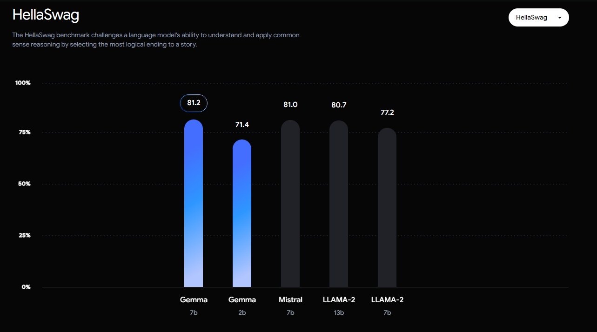

>El repertorio de Inteligencia Artificial de Google se amplía con la introducción de Gemma, su última IA abierta y competidora directa de Llama 2 de Meta.

Los Modelos Abiertos Gemma son una familia de herramientas de última generación que ponen el poder de la inteligencia artificial al alcance de todos. Inspirados en la constelación de Géminis y bautizados con el término latino "gemma" que significa "piedra preciosa", estos modelos livianos y de alto rendimiento abren un mundo de posibilidades para la innovación en IA.

## Nacidos de la investigación de Google DeepMind

Desarrollados por Google DeepMind y otros equipos de Google, los Modelos Abiertos Gemma comparten la misma base tecnológica que los [modelos Gemini](https://promptphi.com/blog/google-presenta-gemine-15-el-modelo-de-ia-que-redefine-el-futuro-de-la-tecnologia/), reconocidos por su avanzada capacidad y eficiencia. Esta herencia garantiza un alto rendimiento en una amplia gama de tareas, desde la traducción de idiomas hasta la generación de contenido creativo.

## Más que modelos, un ecosistema para la innovación

Más allá de los pesos de los modelos, Gemma ofrece un ecosistema completo para impulsar la innovación responsable. Las herramientas disponibles incluyen:

- **Entornos de desarrollo:** Facilitan la experimentación y el desarrollo de aplicaciones con los modelos Gemma.
- **Recursos educativos:** Guías y tutoriales para ayudar a los desarrolladores a aprovechar al máximo las capacidades de Gemma.
- **Foros de colaboración:** Espacios para compartir ideas, experiencias y mejores prácticas con la comunidad de usuarios de Gemma.
## Un futuro brillante para la IA responsable

Los Modelos Abiertos Gemma democratizan el acceso a la IA de última generación, permitiendo a una amplia gama de desarrolladores, desde estudiantes hasta empresas, explorar y crear soluciones innovadoras. Con un enfoque en la accesibilidad, la eficiencia y la responsabilidad, Gemma abre un camino hacia un futuro donde la IA se utiliza para el bien común.

## Gemma y Gemini: Dos caras de la misma moneda para revolucionar la IA

El mundo de la inteligencia artificial (IA) está en constante evolución, y con él, las herramientas que la ponen al alcance de nuestros dedos. Google, consciente de la necesidad de democratizar la IA y hacerla accesible a un público más amplio, ha desarrollado dos plataformas complementarias: Gemma y [Gemini](https://promptphi.com/blog/google-presenta-gemine-15-el-modelo-de-ia-que-redefine-el-futuro-de-la-tecnologia/).

## Gemma: IA generativa al alcance de los desarrolladores

Gemma se presenta como una familia de modelos de [IA generativa](https://promptphi.com/blog/explorando-la-inteligencia-artificial-ia-definicion-y-conceptos-fundamentales/) especialmente diseñada para desarrolladores. Estos modelos livianos y de alto rendimiento permiten crear aplicaciones innovadoras en una amplia gama de campos, desde la traducción automática hasta la generación de contenido creativo.

## Libertad y flexibilidad para la innovación

Gemma pone a disposición de los desarrolladores una serie de herramientas que les permiten:

- **Experimentar** con diferentes modelos de IA y personalizarlos para adaptarlos a sus necesidades específicas.
- **Integrar** la IA en sus aplicaciones de forma fácil y eficiente.
- **Compartir** sus conocimientos y experiencias con la comunidad de desarrolladores de Gemma.

## Gemini: IA intuitiva para el usuario final

Por otro lado, [Gemini se dirige al usuario final](https://promptphi.com/blog/google-presenta-gemine-15-el-modelo-de-ia-que-redefine-el-futuro-de-la-tecnologia/), ofreciendo una experiencia intuitiva y accesible. A través de una interfaz sencilla, Gemini permite a cualquier persona interactuar con la IA para realizar tareas como:

- **Traducir idiomas** de forma rápida y precisa.
- **Generar contenido** original, como poemas, guiones o artículos.
- **Obtener información** de forma más eficiente y personalizada.

## Un ecosistema completo para la IA responsable

Tanto Gemma como Gemini están comprometidas con el desarrollo de una [IA responsable](https://promptphi.com/blog/explorando-la-inteligencia-artificial-mas-alla-de-la-definicion-habitual/). Google ha implementado una serie de medidas para garantizar que estas plataformas se utilicen de forma ética y segura, incluyendo:

- **Directrices de uso responsable:** Orientan a los desarrolladores y usuarios sobre cómo utilizar la IA de forma responsable.
- **Filtros de contenido:** Previenen la generación de contenido inapropiado o dañino.
- **Mecanismos de transparencia:** Permiten a los usuarios comprender cómo funciona la IA y cómo se utilizan sus datos.

## Dos caminos hacia un futuro impulsado por la IA

Gemma y Gemini son dos caras de la misma moneda, dos plataformas que se complementan para impulsar la innovación en IA. Juntas, ofrecen un ecosistema completo que permite a desarrolladores y usuarios finales explorar el potencial de la IA y crear un futuro mejor para todos.