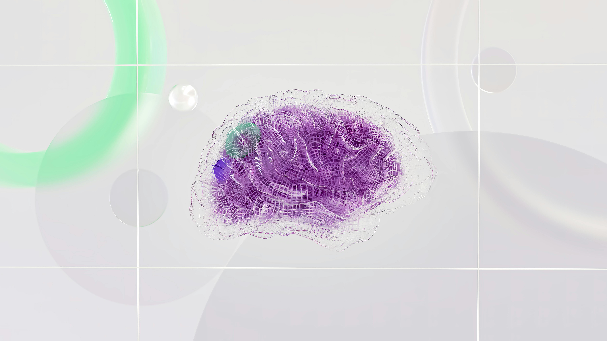

>Google anuncia un hito en el desarrollo de la inteligencia artificial con la presentación de Gemine 1.5, su modelo de próxima generación que ofrece un rendimiento y capacidades sin precedentes.

La semana pasada, presentaron su modelo más avanzado, el Gemini 1.0 Ultra, marcando un paso significativo para hacer que los productos de Google sean más útiles, comenzando con Gemini Advanced. En el día de hoy, los desarrolladores y los clientes de Cloud pueden empezar a trabajar con el 1.0 Ultra también, utilizando nuestra API Gemini en AI Studio y en Vertex AI.

Los equipos siguen explorando los límites de nuestros modelos más recientes, siempre priorizando la seguridad. Están haciendo avances rápidos. De hecho, están listos para presentar la siguiente generación: el Gemini 1.5. Este muestra mejoras dramáticas en varias dimensiones y el 1.5 Pro logra una calidad comparable al 1.0 Ultra, utilizando menos recursos de cómputo.

Esta nueva generación también representa un avance en la comprensión de contextos largos. Han logrado aumentar significativamente la cantidad de información que los modelos pueden procesar, llegando hasta 1 millón de tokens de manera consistente, logrando la ventana de contexto más extensa de cualquier modelo base a gran escala hasta ahora.

Ventanas de contexto más largas nos muestran las promesas de lo que es posible. Permitirán capacidades completamente nuevas y ayudarán a los desarrolladores a construir modelos y [aplicaciones mucho más útiles](https://promptphi.com/tools/). Nos entusiasma ofrecer una vista previa limitada de esta característica experimental a los desarrolladores y clientes empresariales. A continuación, Demis comparte más detalles sobre las capacidades, seguridad y disponibilidad.

## Mayor contexto, capacidades más útiles

La "ventana de contexto" de un modelo de [inteligencia artificial](https://promptphi.com/blog/explorando-la-inteligencia-artificial-ia-definicion-y-conceptos-fundamentales/) está compuesta por tokens, que son los bloques de construcción utilizados para procesar información. Los tokens pueden ser partes completas o subsecciones de palabras, imágenes, videos, audio o código. Cuanto más grande sea la ventana de contexto de un modelo, más información puede absorber y procesar en una indicación dada, haciendo que su producción sea más consistente, relevante y útil.

A través de una serie de innovaciones en aprendizaje automático, hemos aumentado significativamente la capacidad de la ventana de contexto de 1.5 Pro mucho más allá de los 32,000 tokens originales de Gemini 1.0. Ahora podemos ejecutar hasta 1 millón de tokens en producción.

Esto significa que 1.5 Pro puede procesar cantidades vastas de información de una sola vez, incluyendo 1 hora de video, 11 horas de audio, bases de código con más de 30,000 líneas o más de 700,000 palabras. En nuestras investigaciones, también hemos probado con éxito hasta 10 millones de tokens.

## Razonamiento complejo sobre cantidades vastas de información

1.5 Pro puede analizar, clasificar y resumir de manera fluida grandes cantidades de contenido dentro de una indicación dada. Por ejemplo, al proporcionarle los transcripciones de 402 páginas de la misión Apollo 11 a la luna, puede razonar sobre conversaciones, eventos y detalles encontrados a lo largo del documento.

<iframe width="640" height="360" src="https://www.youtube.com/embed/LHKL_210CcU" title="Reasoning across a 402-page transcript | Gemini 1.5 Pro Demo" frameborder="0" allow="accelerometer; autoplay; clipboard-write; encrypted-media; gyroscope; picture-in-picture; web-share" allowfullscreen></iframe>

Gemini 1.5 Pro puede comprender, razonar y identificar detalles curiosos en las transcripciones de 402 páginas de la misión Apollo 11 a la luna.

## Rendimiento mejorado

Cuando se somete a pruebas exhaustivas que abarcan evaluaciones de texto, código, imágenes, audio y video, 1.5 Pro supera al 1.0 Pro en un 87% de los puntos de referencia utilizados para el desarrollo de nuestros modelos de lenguaje a gran escala (LLMs). Y al compararlo con el 1.0 Ultra en los mismos puntos de referencia, su rendimiento se mantiene a un nivel ampliamente similar.

Gemini 1.5 Pro mantiene niveles elevados de rendimiento incluso a medida que aumenta su ventana de contexto. En la evaluación Needle In A Haystack (NIAH), donde se coloca intencionalmente un pequeño fragmento de texto que contiene un hecho o declaración particular dentro de un bloque largo de texto, el 1.5 Pro encontró el texto incrustado el 99% de las veces, en bloques de datos tan largos como 1 millón de tokens.

Gemini 1.5 Pro también muestra impresionantes habilidades de "aprendizaje en contexto", lo que significa que puede aprender una nueva habilidad a partir de la información proporcionada en una indicación larga, sin necesidad de ajustes adicionales. Probamos esta habilidad en el benchmark de Traducción Automática de Un Libro (MTOB), que muestra cuán bien el modelo aprende de información que nunca ha visto antes. Al darle un manual de gramática para Kalamang, un idioma con menos de 200 hablantes en todo el mundo, el modelo aprende a traducir del inglés al Kalamang a un nivel similar al de una persona que aprende a partir del mismo contenido.

Dado que la ventana de contexto largo de 1.5 Pro es la primera de su tipo entre los modelos a gran escala, estamos desarrollando continuamente nuevas evaluaciones y puntos de referencia para probar sus capacidades novedosas.

[Para obtener más detalles consulta aquí](https://goo.gle/GeminiV1-5)

## Amplias pruebas éticas y de seguridad

Siguiendo nuestros [Principios de IA](https://ai.google/responsibility/principles/) y políticas sólidas de seguridad, nos aseguramos de que nuestros modelos sean sometidos a extensas pruebas éticas y de seguridad. Luego, integramos estos aprendizajes de investigación en nuestros procesos de gobernanza y desarrollo y evaluaciones de modelos para mejorar continuamente nuestros sistemas de IA.

Desde la introducción de 1.0 Ultra en diciembre, nuestros equipos han seguido perfeccionando el modelo, haciéndolo más seguro para un lanzamiento más amplio. También hemos llevado a cabo investigaciones novedosas sobre riesgos de seguridad y desarrollado técnicas de red teaming para evaluar una variedad de posibles perjuicios.

Antes de lanzar 1.5 Pro, hemos adoptado el mismo enfoque para la implementación responsable que hicimos con nuestros modelos Gemini 1.0, realizando evaluaciones exhaustivas en áreas que incluyen la seguridad del contenido y daños representativos, y seguiremos expandiendo estas pruebas. Además de esto, estamos desarrollando pruebas adicionales que tengan en cuenta las novedosas capacidades de contexto largo de 1.5 Pro.

### Un modelo multimodal para un mundo conectado

Gemine 1.5 es un modelo multimodal, lo que significa que puede comprender y generar información en diferentes formatos, incluyendo texto, imágenes, audio y código. Esta capacidad lo convierte en una herramienta poderosa para una amplia gama de aplicaciones, como:

- **Traducción:** Gemine 1.5 puede traducir entre idiomas con una precisión y fluidez nunca antes vistas.
- **Escritura:** Puede generar contenido original de alta calidad, como artículos, poemas, guiones e incluso código.
- **Búsqueda:** Puede ayudar a encontrar información de forma más rápida y precisa, incluso cuando las consultas son complejas o ambiguas.

## Un futuro impulsado por Gemine 1.5

Google está convencido de que Gemine 1.5 tiene el potencial de transformar la forma en que interactuamos con la tecnología. Este modelo abre nuevas posibilidades para la creatividad, la productividad y la accesibilidad a la información.